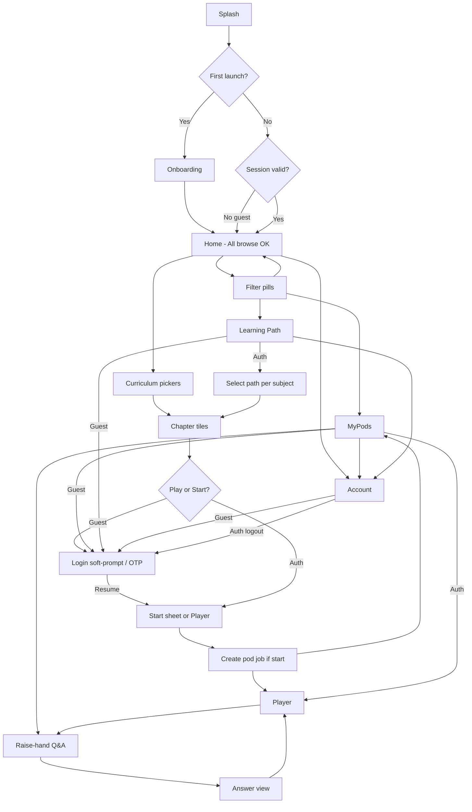
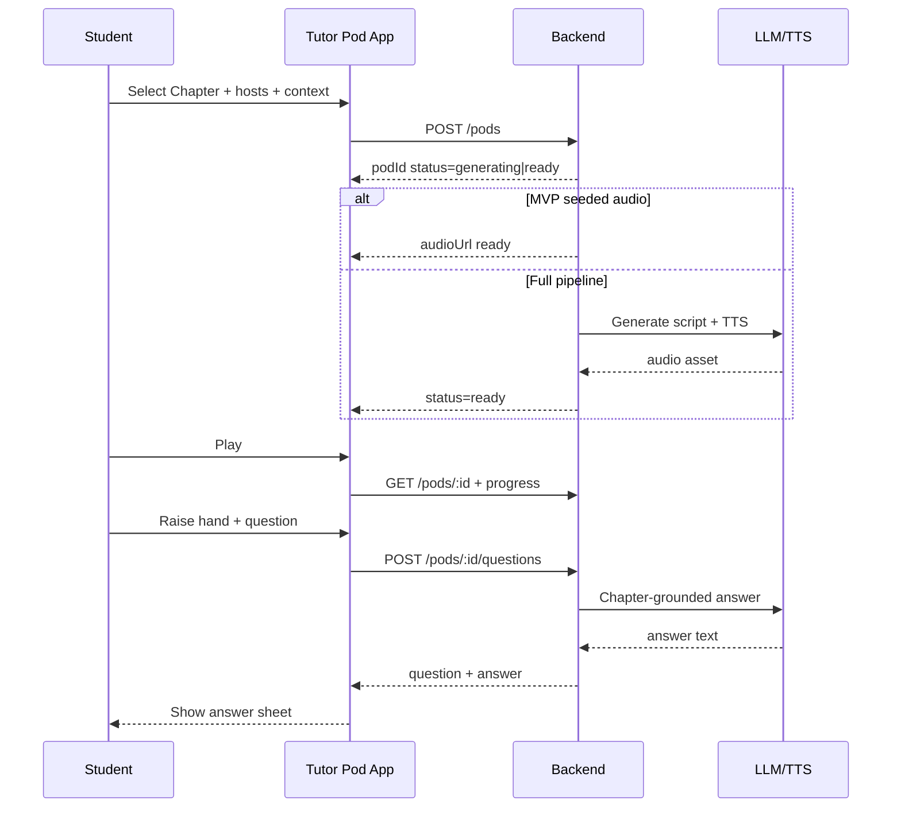

# User Flows — Tutor Pod

## Flow map (tree)

```text
App Launch
 ↓
Splash
 ↓
Onboarding (first launch only)
 ↓
Home (All) — guest OK for browse  OR  Login if user chose Sign in
 ├── All (guest or student)
 │    ├── Select Standard / Subject filters (browse OK)
 │    ├── Browse chapter tiles (photo + title + meta)
 │    ├── Tap Play / Start podcast
 │    │    ├── [GUEST] → Login soft-prompt → OTP → resume Start/Player
 │    │    └── [AUTH] → Start Podcast sheet → Generating → Player / MyPods
 │    └── …
 │
 ├── MyPods
 │    ├── [GUEST] → Sign-in CTA (no listen without login)
 │    └── [AUTH] Pod rows → Player / Raise-hand
 │
 ├── Learning Path
 │    ├── [GUEST] → Sign-in CTA (create/select path requires login)
 │    └── [AUTH] Select subject → Choose path → chapters → Start / Play
 │
 └── Account
      ├── [GUEST] → Sign in
      └── [AUTH] Name + Standard / Logout

Error / Offline / Empty branches from each major screen
```

## Mermaid





## Flows

### F001 — First-time launch & onboarding
- **Entry point:** Cold start, no local “onboardingComplete” flag.
- **User action:** Swipe/read short value props; tap Get started / Browse.
- **System response:** Persist onboarding flag; navigate to **Home All** (guest browse). Optional “Sign in” from header. **UPDATED:** no hard login wall after onboarding.
- **Next step:** F004 (browse) or F002 if user chooses Sign in.
- **Success state:** Onboarding complete → Home All.
- **Error state:** N/A (local only).
- **Empty state:** N/A.
- **Loading state:** Splash brand mark.
- **Back navigation:** Exit app on root back (platform default).

### F002 — Authentication (login / soft-prompt)
- **Entry point:** Explicit Sign in; **or soft-prompt** from Play / Start podcast / MyPods listen / Learning Path select / Account; or expired session on gated API.
- **User action:** Enter email → request OTP → enter OTP.
- **System response:** Validate OTP; issue session tokens; fetch profile (name, Standard); **resume pending action** if soft-prompt context exists. `[ASSUMPTION: resume Play/Start/Learning Path after login.]`
- **Next step:** Resume target (F005 / F007 / F009) or Home (All). If Standard missing → prompt set Standard. `[ASSUMPTION: Standard collected at signup or first Account prompt.]`
- **Success state:** Authenticated; gated action continues.
- **Error state:** Invalid OTP, rate limit, network error with retry.
- **Empty state:** N/A.
- **Loading state:** Verifying OTP spinner on CTA.
- **Back navigation:** From OTP back to email; dismiss soft-prompt returns to prior browse screen **without** playing audio.

### F003 — Returning user
- **Entry point:** App launch with valid refresh token (or guest with no session).
- **User action:** Open app.
- **System response:** If session valid → silent refresh + Home with last filters; if guest → Home All browse. `[ASSUMPTION: remember last Standard/Subject for both guest and auth.]`
- **Next step:** Home.
- **Success / Error / Empty / Loading / Back:** Session restore spinner; on refresh failure clear tokens → guest Home (not forced Login).

### F004 — Home / All — browse & filter chapters
- **Entry point:** Bottom nav Home or pill **All** (guest or auth).
- **User action:** Change Standard / Subject; scroll chapter tiles; optional search (P1).
- **System response:** Fetch **public catalog** chapters; render photo tiles + meta + play affordance.
- **Next step:** If auth → F005 / F007; if guest taps Play/Start → **F012 soft-prompt** then F005/F007.
- **Success state:** Tiles populated (guest or auth).
- **Error state:** Catalog fetch failed → retry banner.
- **Empty state:** “No chapters for this selection.”
- **Loading state:** Skeleton tiles.
- **Back navigation:** N/A (root tab).

### F005 — Start podcast (hosts + context) — auth required
- **Entry point:** Chapter tile CTA / “Start podcast” (only after auth or post soft-prompt resume).
- **User action:** Set hosts 2–4; optional + context; confirm Start.
- **System response:** Guard: if unauthenticated → F012. Else `POST /pods`; generating → Player / MyPods.
- **Next step:** F007 Player.
- **Success state:** Pod ready, playback starts (or user taps Play). `[ASSUMPTION: auto-navigate to Player when ready.]`
- **Error state:** Validation (hosts), quota, generation failure → message + retry; `401` → F012.
- **Empty state:** N/A.
- **Loading state:** Generating overlay / indeterminate progress.
- **Back navigation:** Dismiss sheet cancels unconfirmed start; in-flight job continues server-side. `[ASSUMPTION]`

### F006 — MyPods library — auth required to listen
- **Entry point:** Pill **MyPods** or bottom nav MyPods.
- **User action:** Scroll pods; tap Play; tap Raise hand; pull to refresh.
- **System response:** **UPDATED:** Guest → sign-in CTA (no pod list / no play). Auth → list pods with duration, progress, raise-hand, play.
- **Next step:** F007 or F008 (auth); F012 (guest).
- **Success state:** Non-empty list or empty CTA to start first pod.
- **Error / Empty / Loading / Back:** Guest empty = sign-in; auth empty → “Start a podcast from All.”

### F007 — Audio player — auth required
- **Entry point:** Play from chapter tile, MyPods row, or post-generation (**auth only**; deep link without session → F012).
- **User action:** Play/pause, seek, ±10s, speed cycle, like/dislike, raise hand, back.
- **System response:** Never stream audio anonymously; persist progress; save reaction.
- **Next step:** F008; back to previous list.
- **Success state:** Smooth playback with accurate times.
- **Error state:** Audio URL failure → retry; `401` → F012; reaction failure toast (non-blocking).
- **Empty state:** N/A.
- **Loading state:** Buffering indicator on play button / seek bar.
- **Back navigation:** Preserve position; return to MyPods or All.

### F008 — Raise-hand Q&A
- **Entry point:** Raise-hand on MyPods row or Player (implies auth + active listen context).
- **User action:** Type/speak question → Submit. `[ASSUMPTION: text input MVP; voice input P2.]`
- **System response:** Pause audio; `POST` question; show answer; optional continue listening.
- **Next step:** Return to Player/MyPods; answer history on sheet.
- **Success state:** Answer displayed.
- **Error state:** AI/timeout → friendly retry; offline → blocked with message.
- **Empty state:** Prompt “What are you stuck on?”
- **Loading state:** “Thinking…” with cancel. `[ASSUMPTION: cancel aborts client wait; server may still complete.]`
- **Back navigation:** Close sheet resumes playback from pause point.

### F009 — Learning Path — auth required to create/select
- **Entry point:** Pill **Learning Path**.
- **User action:** Pick subject → select path → open recommended chapter.
- **System response:** **UPDATED:** Guest → sign-in CTA (no path create/select). Auth → load paths; save selection; list ordered chapters. Play/Start on chapters still subject to listen auth (already satisfied).
- **Next step:** F005 / F007; or F012 if guest.
- **Success state:** Path active badge on subject; ordered list shown.
- **Error / Empty / Loading / Back:** Guest = sign-in CTA; empty if no paths seeded; error retry.

### F010 — Account
- **Entry point:** Avatar / Account tab.
- **User action:** View name + Standard; optionally edit Standard; logout — or Sign in if guest.
- **System response:** Guest → Sign in CTA; Auth → profile; PATCH Standard; clear session on logout → guest Home.
- **Next step:** Home after Standard change; after logout → F004 guest browse (not forced re-login wall).
- **Success / Error / Empty / Loading / Back:** Form validation on Standard; logout confirm dialog. `[ASSUMPTION: confirm before logout.]`

### F012 — Login soft-prompt + resume (NEW)
- **Entry point:** Guest taps Play, Start podcast, MyPods listen, Learning Path select/create, or raise-hand.
- **User action:** Sign in / Continue to OTP; or Cancel.
- **System response:** Present modal/sheet explaining why login is needed; stash `pendingAction` (`playChapter`, `startPodcast`, `openLearningPath`, `playPod`); on success run F002 → resume.
- **Next step:** F005 / F007 / F009 as pending; Cancel → prior screen, no audio.
- **Success state:** Pending action executes once.
- **Error state:** Auth errors stay on F002; pendingAction retained until cancel/success. `[ASSUMPTION]`
- **Empty / Loading / Back:** Cancel clears pendingAction.

### F011 — Error / offline recovery
- **Entry point:** Any network failure.
- **User action:** Retry / open settings.
- **System response:** Banner or full-screen offline; queue non-critical progress sync. `[ASSUMPTION: progress sync retries when online; Q&A and start-pod require online.]`
- **Next step:** Resume prior screen.
- **Success / Error / Empty / Loading / Back:** As applicable.

## Notification flow
- `[ASSUMPTION: No push notifications in MVP.]` Optional P2: “Your podcast is ready” when generation completes in background.
